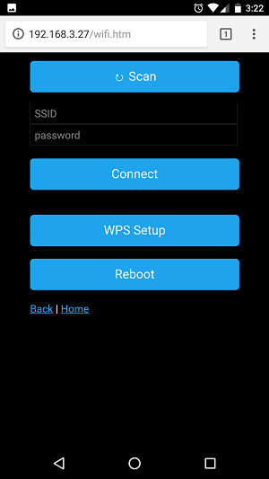
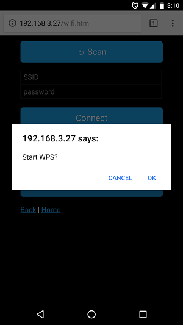

- [How it Works](#how-it-works)
	- [Example '/wifi/list' output](#example-wifilist-output)
- [Screenshots](#screenshots)
	- [Main WiFi Setup Page](#main-wifi-setup-page)
	- [WiFi Scan Function](#wifi-scan-function)
	- [WPS Setup](#wps-setup)

# How it Works

When creating an instance of a PersWiFiManager object, it takes arguments of an already-declared ESP8266WiFiManager and DNSServer, and attaches the wifi settings handlers to them. This way, they can continue to be used in the main program.

The WiFi setup page is static and served from SPIFFS (or PROGMEM). It has a form for manual SSID/password input. If the user wants to scan for WiFi networks, it makes a request to the server, which responds with a CSV-style list of available WiFi networks (sorted by signal, with duplicates removed). I chose CSV over JSON because, even with the ArduinoJSON library or proper manual escaping, I still encountered a few wireless networks with bad characters that would invalidate the entire json string. The page uses javascript to parse the list and display it. The interface also has a WPS setup button, and a Reboot button.

## Example '/wifi/list' output

Each line represents a network in the format: `signal,encrypted,SSID`

```
100,1,DAY LAN
94,1,FIGHTER OF THE NIGHT LAN
50,0,linksys
50,0,xfinitywifi
48,1,XFINITY
40,1,DIRECT-8C0A0D0F
```

Commas in the SSID are ok; the javascript in the wifi.htm page splits the lines by commas but re-merges anything after the second column. It also uses the DOM `createTextNode` method to display the network names, so any other special symbols are displayed properly as well.

# Screenshots
## Main WiFi Setup Page



## WiFi Scan Function


## WPS Setup




